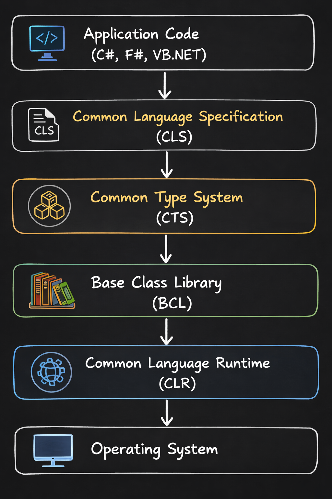

# **.NET Mimarisi**
## Tanım

.NET, farklı programlama dillerinin **aynı runtime üzerinde çalışmasını sağlayan bir platformdur**.
Temel bileşenleri:
- [CLR](01-common-language-runtime.md)
- Common Type System (CTS) 
- Common Language Specification(CLS)
- Base Class Library (BCL)





---
## Common Language Runtime (CLR)

**CLR**, .NET uygulamalarının çalıştığı **runtime ortamıdır**.

Görevleri:
- IL kodunu çalıştırmak
- JIT compilation
- Memory management
- Garbage Collection
- Exception handling
- Thread management
- Security

Kodun çalışma süreci:


CLR kısaca **.NET uygulamasının execution engine’idir.**

---
## CTS (Common Type System)

**CTS**, .NET içindeki tüm veri tiplerinin nasıl tanımlandığını belirleyen sistemdir.

Amaç:
Farklı .NET dillerinin **aynı type sistemini kullanmasını sağlamak**.

CTS sayesinde:
- C#
- F#
- VB.NET
aynı veri tiplerini anlayabilir.

Örnek:
```csharp
int  
string  
bool  
object
```

### CTS iki ana tipe ayırır:
#### 1) Value Types
Stack üzerinde tutulur.

Örnek:

```csharp
int  
bool  
double  
struct
```
#### 2) Reference Types

Heap üzerinde tutulur.

Örnek:
```csharp
class  
string  
object  
array
```

---
## Common Language Specification (CLS)

**CLS**, .NET dillerinin birbirleriyle uyumlu çalışabilmesi için belirlenen **kurallar setidir**.

Yani:
CTS tüm tipleri tanımlar  
CLS ise **dillerin ortak kullanabileceği kısmı belirler.**

Örnek:
C#’ta şu tip vardır:

```csharp
uint
```

Ama bazı .NET dilleri bunu desteklemez.
Bu yüzden **CLS uyumlu değildir.**
CLS uyumlu tipler:

```csharp
int  
string  
bool
```

CLS uyumlu olmayan tip örneği:
```csharp
uint  
ulong
```

CLS uyumlu olmayan kod:
```csharp
public uint number;
```

Fakat bu kod uyumludur. Çünkü private kod başka diller tarafından kullanılmaz.
```csharp
private uint number;
```

#### CLS Compilance

Bir assembly ve classın CLS uyumlu olduğunu belirtmek için;
```csharp
[assembly:CLSComplient(true)] 
```
eklenir.

```csharp
[CLSCompliant(false)]  
public uint GetNumber()  
{  
    return 10;  
}
```
Bu şu anlama gelir:
Bu method CLS uyumlu değil ama bilinçli yaptım. **Önerilmez!!!!**


--- 
## Base Class Library (BCL)

**BCL**, .NET’in standart kütüphanesidir.
Temel sınıfları içerir.

Örnek namespace’ler:

```csharp
System  
System.Collections  
System.IO  
System.Linq  
System.Threading
```

Örnek kullanım:
```csharp
Console.WriteLine("Hello");
```

Bu aslında **BCL içindeki bir class’tır.**

---

## Özet

**CLR**
- Runtime ortamıdır
- Memory, GC, JIT yönetir

**CTS**
- .NET type sistemidir
- Value vs Reference types

**CLS**
- Diller arası uyumluluk kurallarıdır

**BCL**
- .NET’in standart kütüphanesidir

---

## Mülakat Sorusu

Soru:
- CTS ile CLS arasındaki fark nedir?

Cevap:
- **CTS** .NET’teki tüm veri tiplerini tanımlar
- **CLS** diller arası uyumluluk için CTS’in bir alt kümesidir