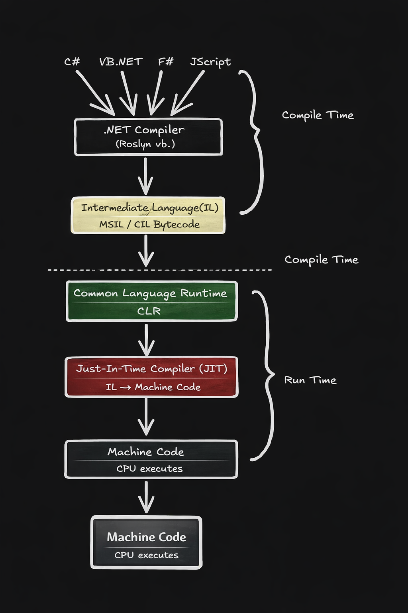

# **Just-In Time Compiler (JIT)**
## Tanım

**Just-In-Time Compiler (JIT)**, .NET’te **[IL](02-intermediate-language.md)** kodunu **çalışma anında makine koduna çeviren derleyicidir.**

JIT, **[CLR](01-common-language-runtime.md) içinde çalışan bir bileşendir** ve CPU’nun çalıştırabileceği **native machine code** üretir.

---
## Diyagram

.NET uygulaması çalışırken kod şu aşamalardan geçer:


Özetle:
- C# → **IL**
- IL → **JIT tarafından Machine Code**

---
## JIT Nasıl Çalışır?

JIT tüm programı bir anda derlemez.
**Method bazlı çalışır.**
Bir method ilk kez çağrıldığında:
1. CLR methodu yükler
2. JIT IL kodunu alır
3. Machine code üretir
4. Bu kod memory’e kaydedilir
5. Sonraki çağrılarda tekrar compile edilmez

Örnek:
```csharp
void Calculate()  
{  
	Console.WriteLine("Hello");  
}
```
`Calculate()` methodu ilk çağrıldığında JIT compile edilir.

---
## JIT’in Avantajları

Platform Bağımsızlık
IL platform bağımsızdır.
JIT çalıştığı platforma göre makine kodu üretir.

Örnek:
- Windows → x64 code
- Linux → farklı machine code

---
## Runtime Optimizasyonu

JIT çalışma anında optimizasyon yapabilir.

Örneğin:
- CPU özelliklerine göre optimize eder
- Method inlining yapabilir
- Dead code kaldırabilir

--- 
## JIT Türleri

#### **1) Normal JIT**

En yaygın kullanılan türdür.
- Method ilk çağrıldığında compile edilir.
- 
#### **2️) Pre-JIT**

Kod uygulama başlamadan önce compile edilir.
Bunun için kullanılan teknoloji:
**NGen (Native Image Generator)**

#### **3️) Econo-JIT**

Memory tasarrufu için kullanılan eski bir JIT türüdür.
Modern .NET’te pek kullanılmaz.

---
## JIT Cache

JIT compile edilen methodlar memory’de tutulur.
Bu sayede:
- Aynı method tekrar compile edilmez
- Performans artar

---
## Örnek

```csharp
int x = 10;  
int y = 20;  
  
Console.WriteLine(x + y);
```

```IL
ldloc.0  
ldloc.1  
add  
call Console.WriteLine
```

```JIT
mov eax,10  
add eax,20  
call WriteLine
```

---
## Özet

- JIT = **runtime compiler**
- IL → Machine Code dönüşümünü yapar
- CLR içinde çalışır
- Method bazlı compile eder
- Compile edilen kod memory’de saklanır

